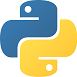

<div align="center">


# Challenge da Sprint 4

[](https://github.com/BeatrizJardimm/RoboTron_Beatriz_Louback_Compass/blob/develop/LICENSE)
  
</div>

* Esse repositório é composto por exercícios desenvolvidos em **Python**.
* Os exercícios que compõem esse projeto foram desenvolvidos através da IDE **VS Code**.
* A ferramenta **Git** foi usada para transformar o projeto em um repositório e depois armazená-lo no GitHub.

## Características do projeto 

O projeto está dividido em pastas. Cada pasta contém os arquivos correspontes a extensão que dá nome a pasta, ou seja, na pasta "json" estão os arquivos *.json*, na pasta "csv" estão os arquivos *.csv* e na pasta "python" estão os arquivos de exercícios desenvolvidos nessa linguagem. Já a pasta "midia" é composta por todas as imagens utilizadas no arquivo que você está lendo agora!

Existem 5 arquivos de exercícios desenvolvidos em Python. As baterias de exercícios foram propostas em dias diferentes e baseados em JSONs e CSVs diferentes, portanto, cada arquivo contém a resolução dos exercícios do dia em questão com base no arquivo que foi trabalhado entre eles.

### Exercícios do dia 5:

Como todos os exercícios desse dia foram resolvidos no mesmo arquivo, desenvolvi uma função para cada enunciado e, ao final do código, chamei as funções criadas para gerar um produto visível de cada exercício.

Algumas questões foram resolvidas usando condicionais e while loops, você pode ler mais sobre essas estruturas a partir dos links abaixo:

* [Condicional if...Else](https://www.w3schools.com/python/python_conditions.asp)
* [While loop](https://www.w3schools.com/python/python_while_loops.asp)

Além disso, também utilizei algumas funções *built-in* do Python, são essas:

| Função      | Descrição   |
| :---        |    :----:   |
| sum([x, y, z]) | soma todos os elementos de uma lista, tuple ou outro (nesse caso x+y+z) |
| len([x, y, z]) | retorna o comprimento do parâmetro passado (nesse caso 3) |
| .append(x) | adiciona o parametro passado (x) à lista que foi referenciada |
| .format(valor) | adiciona o valor do parâmetro na posição referenciada em uma string |

Note que esse arquivo pode ser rodado tanto no terminal da IDE escolhida quanto no Prompt de Comando do seu sistema operacional.

### Exercícios do dia 7:

Os exercícios desse dia foram divididos em diferentes arquivos, cada um contém os enunciados relacionados ao seu respectivo arquivo **JSON** ou **CSV**.

* [Dia7_json1](https://github.com/BeatrizJardimm/RoboTron_Beatriz_Louback_Compass/blob/develop/python/Dia7_json1.py) utiliza o [partidaJSON.json](https://github.com/BeatrizJardimm/RoboTron_Beatriz_Louback_Compass/blob/develop/json/partidaJSON.json)
* [Dia7_json2](https://github.com/BeatrizJardimm/RoboTron_Beatriz_Louback_Compass/blob/develop/python/Dia7_json2.py) utiliza o [campeonatoJSON.json](https://github.com/BeatrizJardimm/RoboTron_Beatriz_Louback_Compass/blob/develop/json/campeonatoJSON.json)
* [Dia7_csv](https://github.com/BeatrizJardimm/RoboTron_Beatriz_Louback_Compass/blob/develop/python/Dia7_csv.py) utiliza o [filmesCSV.csv](https://github.com/BeatrizJardimm/RoboTron_Beatriz_Louback_Compass/blob/develop/csv/filmesCSV.csv)
* [Dia7_desafio](https://github.com/BeatrizJardimm/RoboTron_Beatriz_Louback_Compass/blob/develop/python/Dia7_desafio.py) utiliza o [elementosRadioativos.csv](https://github.com/BeatrizJardimm/RoboTron_Beatriz_Louback_Compass/blob/develop/csv/elementosRadioativos.csv)

Para ler e conseguir manipular os arquivos em [JSON](https://www.devmedia.com.br/o-que-e-json/23166) e [CSV](https://rockcontent.com/br/blog/csv/), foi necessário importar algumas bibliotecas do Python que facilitam essas atividades. No caso desse projeto, utilizamos a biblioteca *json* para resolver os exercícios que se baseam em arquivos dessa extensão e a biblioteca *pandas* para solucionar os exercicios que trabalham com CSV. Você pode aprender mais sobre essas bibliotecas a partir dos seguintes links:

* Biblioteca *json*:
    * [Documentação](https://docs.python.org/pt-br/3/library/json.html)
    * [Artigo](https://www.freecodecamp.org/portuguese/news/ler-arquivos-json-em-python-como-usar-load-loads-e-dump-dumps-com-arquivos-json/)

* Biblioteca *pandas*:
    * [Documentação](https://pandas.pydata.org/docs/)
    * [Vídeo](https://www.youtube.com/watch?v=C0aj3FjN5e0)


##  Como criar uma cópia do projeto

Para obter uma cópia desse projeto em sua máquina local, siga os passos abaixo:

1. Crie um *Fork* desse projeto no seu perfil do GitHub
2. Instale a IDE de sua preferência que seja compatível com a linguagem Python ([Aqui](https://blog.geekhunter.com.br/ides-e-editores-de-codigo-em-python-para-2021/) estão algumas opções).
3. Instale a versão do [Git](https://git-scm.com/downloads) compatível com seu sistema operacional.
4. Depois de [configurar o Git](https://www.youtube.com/watch?v=UBAX-13g8OM) em sua máquina, rode o seguinte código:

<code>
$ git clone https://github.com/BeatrizJardimm/RoboTron_Beatriz_Louback_Compass.git
</code>

Agora você tem uma cópia dos exercícios em sua máquina! :)

##  Como contribuir

Caso encontrou algum erro nos códigos ou pontos que podem ser melhorados, fique a vontade para fazer modificações na versão que você insalou em sua máquina! Para isso, crie uma nova branch e dê um nome sugestivo a ela.
<br>
Faça suas alterações **APENAS** dentro dessa branch.
<br>
Após fazer suas alterações, suba a nova versão dos códigos para seu repositório no GitHub utilizando o ```git push <nome-branch>```, e então é só [criar um *pull request*](https://docs.github.com/pt/pull-requests/collaborating-with-pull-requests/proposing-changes-to-your-work-with-pull-requests/creating-a-pull-request) na plataforma do GitHub.

##  Referências

Ao longo do projeto, encontrei algumas dificuldades, então encontrei soluções nos seguintes links:

* Dia 5 - Exercício 10: [Encontrar elementos em uma lista](https://stackoverflow.com/questions/9542738/python-find-in-list)

* README: [Documentação do Markdown](https://www.markdownguide.org/)

* README: [Como colocar imagens](https://medium.com/markdown-monster-blog/getting-images-into-markdown-documents-and-weblog-posts-with-markdown-monster-9ec6f353d8ec)

* README: [Como centralizar textos](https://stackoverflow.com/questions/14051715/markdown-native-text-alignment)

* README: [Como criar tabelas](https://www.markdownguide.org/extended-syntax/#:~:text=for%20more%20information.-,Tables,either%20end%20of%20the%20row.)

Além disso, também recebi ajuda da minha colega Amanda Bressam, o perfil dela no GitHub pode ser acessado através desse [link](https://github.com/abressam).
<br>
Muito obrigada Amandinha! :)

## Considerações finais

Prontinho!
<br>
Com base nas informações desse documento, agora você é capaz de acessar, modificar e compartilhar esse projeto!
<br>

<div align="center">


</div>

##  Autora

Meu perfil no [GitHub](https://github.com/BeatrizJardimm).
<br>
Meu perfil no [LinkedIn](https://www.linkedin.com/in/paula-beatriz-jardim-11882521a/).

<hr>

<div align="center">

 

</div>
